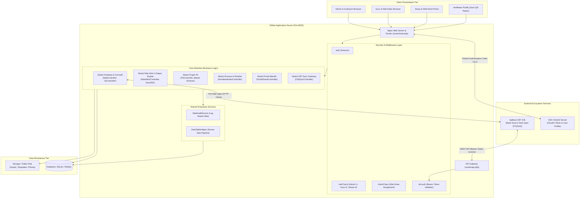
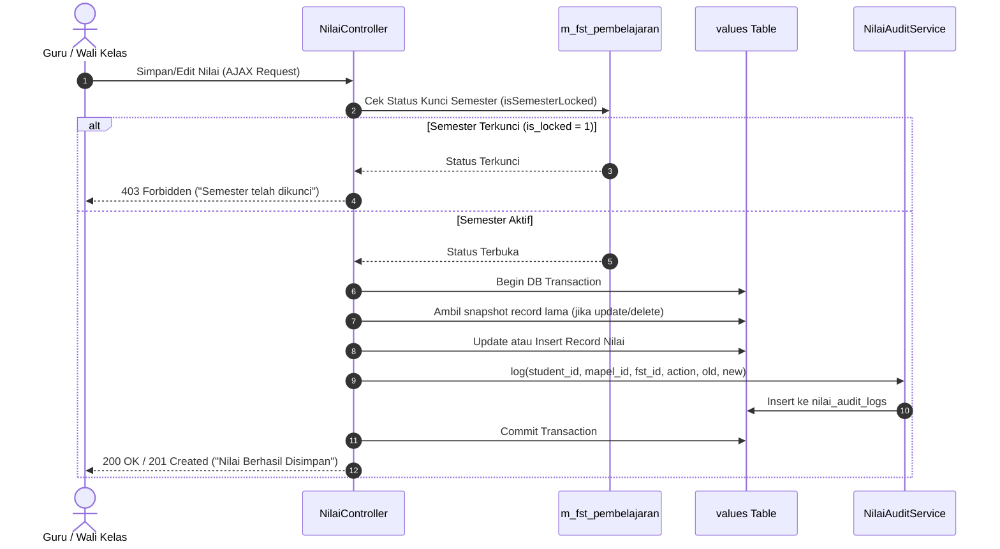
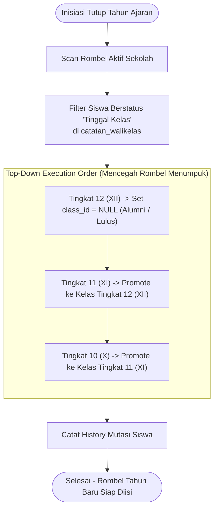

# DOKUMENTASI TEKNIS & BLUEPRINT ARSITEKTUR SISTEM SiNilai

**Sistem Informasi Penilaian, E-Rapor Kurikulum Merdeka, & Sinkronisasi CBT**  
_Klasifikasi Dokumen: Enterprise Technical Handover & Architecture Reference_

---

## 1. Executive Summary & Architecture Overview

### 1.1 Tujuan Sistem & Problem Bisnis

**SiNilai** adalah platform sistem informasi akademik tingkat enterprise yang didesain khusus untuk mengotomatisasi siklus penilaian, rekapitulasi capaian belajar, dan penerbitan buku rapor resmi berbasis **Kurikulum Merdeka** pada jenjang pendidikan dasar dan menengah.

Sistem ini menyelesaikan sejumlah tantangan operasional dan teknis utama:

1. **Kompleksitas Evaluasi Kurikulum Merdeka**: Mengintegrasikan penilaian sumatif (harian, STS, SAS), Kriteria Ketercapaian Tujuan Pembelajaran (KKTP / Formatif), Projek Penguatan Profil Pelajar Pancasila (P5), ekstrakurikuler, presensi, serta deskripsi capaian otomatis ke dalam satu dokumen rapor resmi.
2. **Fleksibilitas Struktur Mata Pelajaran**: Menyelesaikan kendala kurikulum lintas rombel melalui fitur _Dynamic Subject Mapping_ (`mapel_class_fst`) yang mengaktifkan/menonaktifkan mata pelajaran per kelas dan per semester secara independen tanpa merusak struktur database global.
3. **Performa Tinggi Beban Rekapitulasi Rapor**: Menghilangkan overhead ORM melalui implementasi arsitektur **Direct Query Builder (Non-ORM)**, memungkinkan agregasi nilai ratusan siswa dengan puluhan mapel secara _instant_ melalui SQL aggregation dinamis.
4. **Interoperabilitas Ekosistem Sekolah**: Terintegrasi dua arah dengan server **Computer Based Test (CBT)** melalui RESTful Sync Engine dan **Single Sign-On (SSO)** OAuth2 berbasis Authorization Code Flow serta Single Logout (SLO).
5. **Integritas Dokumen & Validasi Publik**: Melindungi legalitas lembar raport hasil cetak dengan stempel digital QR-Code token unik 32-karakter yang dapat diverifikasi secara publik tanpa memerlukan akses login.

---

### 1.2 Tech Stack Matrix

| Kategori                    | Teknologi / Library                 | Versi                       | Alasan Pemilihan & Peran Arsitektur                                                                                      |
| :-------------------------- | :---------------------------------- | :-------------------------- | :----------------------------------------------------------------------------------------------------------------------- |
| **Backend Language**        | PHP                                 | `^8.2`                      | Fitur typed properties, match expression, readonly classes, dan performa tinggi JIT compiler.                            |
| **Framework**               | Laravel Framework                   | `^11.31`                    | Framework MVC robust, routing fleksibel, middleware modular, dan artisan CLI.                                            |
| **Database Engine**         | SQLite / MySQL                      | 3.x / 8.0+                  | **SQLite**: Zero-config pada environment lokal/portable dev.<br>**MySQL/MariaDB**: Production high-concurrency database. |
| **Database Access Pattern** | Laravel Query Builder (`DB::table`) | Bawaan Laravel              | **Non-ORM**: Menghindari overhead hidrasi model Eloquent pada query pivot dinamis dan kalkulasi agregat rapor.           |
| **PDF Rendering**           | Barryvdh Laravel DomPDF             | `^3.1`                      | Engine rendering PDF dari Blade HTML/CSS standar untuk cetak Rapor Akademik & Rapor P5.                                  |
| **QR Code Generator**       | chillerlan/php-qrcode               | `^6.0`                      | Generator QR Code SVG/PNG Data-URI untuk stempel verifikasi publik lembar rapor.                                         |
| **Spreadsheet Engine**      | Maatwebsite Excel                   | `^3.1`                      | Import template nilai & export leger/ranking nilai akhir ke format XLSX.                                                 |
| **UI Framework**            | AdminLTE 3 / Bootstrap              | `~4.6.1`                    | Dashboard UI admin klasik yang stabil, responsif, dan mudah dipahami guru/wali kelas.                                    |
| **Asset Bundler**           | Vite & PostCSS                      | `^6.0` / `^8.4`             | Hot Module Replacement (HMR) cepat dan kompilasi stylesheet modern.                                                      |
| **Client-side Utilities**   | jQuery, DataTables BS4, SweetAlert2 | `3.3.1` / `2.2.2` / `11.16` | Interaksi AJAX asinkron, grid tabel dinamis, modal konfirmasi, dan toast notifikasi interaktif.                          |
| **Data Visualization**      | Chart.js                            | `^4.4.7`                    | Visualisasi statistik performa akademik pada dashboard portal siswa & guru.                                              |

---

### 1.3 High-Level Architecture

Arsitektur SiNilai mengadopsi model terdistribusi berorientasi layanan yang menghubungkan klien web internal/eksternal, portal siswa mandiri, mesin otentikasi sentral (SSO), serta engine ujian daring (CBT).



---

## 2. Directory Tree & Codebase Blueprint

### 2.1 Anotasi Pohon Direktori Utama

```text
SiNilai/
├── app/
│   ├── Exports/                         # Class export spreadsheet (Maatwebsite)
│   │   ├── LegerNilaiExport.php         # Export leger komprehensif nilai per kelas
│   │   ├── NilaiAkhirExport.php         # Export rekapitulasi rata-rata nilai akhir
│   │   └── RankingExport.php            # Export perankingan siswa berbasis mapel aktif
│   ├── Http/
│   │   ├── Controllers/
│   │   │   ├── Api/
│   │   │   │   └── CbtSyncController.php    # REST API endpoints untuk CBT (kelas, siswa, mapel, push scores)
│   │   │   ├── Auth/                    # Laravel default auth controllers (Login, Register, Reset)
│   │   │   ├── CatatanWalasController.php   # Manajemen catatan wali kelas & rekap presensi (S/I/A)
│   │   │   ├── ClassController.php          # CRUD master rombongan belajar / kelas
│   │   │   ├── DataSekolahContoller.php     # Konfigurasi instansi sekolah & legalitas kepala sekolah
│   │   │   ├── EskulController.php          # CRUD master ekstrakurikuler
│   │   │   ├── FstController.php            # CRUD Fase/Semester/Tahun Ajaran & Semester Lock mechanism
│   │   │   ├── HomeController.php           # Dashboard statistik utama
│   │   │   ├── KenaikanKelasController.php  # Algoritma auto-promotion berjenjang & tutup tahun ajaran
│   │   │   ├── MapelController.php          # CRUD master mata pelajaran
│   │   │   ├── MapelMappingController.php   # Pemetaan pivot status mapel aktif per kelas/semester
│   │   │   ├── NilaiAkhirController.php     # Engine kalkulasi pivot SQL nilai akhir, ranking, & PDF Rapor
│   │   │   ├── NilaiAuditController.php     # Viewer audit trail mutasi nilai
│   │   │   ├── NilaiController.php          # Entry nilai harian/STS/SAS, CSV import, & CBT Pull Client
│   │   │   ├── P5Controller.php             # Pengelolaan projek P5, rubrik subelemen, & cetak rapor P5
│   │   │   ├── PeskulController.php         # Penilaian capaian ekstrakurikuler siswa
│   │   │   ├── PortalSiswaController.php    # Self-service dashboard portal siswa & generate akun masal
│   │   │   ├── ProfileController.php        # Pengaturan profil pengguna
│   │   │   ├── PublicVerificationController.php # Landing page publik verifikasi keaslian rapor via QR
│   │   │   ├── SettingController.php        # Pengaturan server SSO client credentials
│   │   │   ├── SiswaController.php          # Master data siswa & template import Excel siswa
│   │   │   ├── SsoController.php            # OAuth2 Client Handler (Redirect, Callback, SLO)
│   │   │   ├── TpController.php             # Master Tujuan Pembelajaran (TP) & Asesmen Formatif (KKTP)
│   │   │   └── UserController.php           # Manajemen user, penugasan role, dan assignment kelas
│   │   └── Middleware/
│   │       ├── CbtSyncAuth.php              # Guard API CBT via Bearer Token dengan timing attack safe check
│   │       ├── CheckAssignedClass.php       # Enforcer agar guru/wali kelas wajib memiliki penugasan rombel
│   │       └── RoleCheck.php                # Role-based Access Control (RBAC) guard
│   ├── Models/
│   │   ├── Setting.php                  # Model key-value untuk parameter konfigurasi dinamis
│   │   └── User.php                     # Authenticatable model untuk identitas user sistem
│   └── Services/
│       ├── DataTableHelper.php          # Utility server-side DataTables pagination, search, & sort
│       └── NilaiAuditService.php        # Service pencatatan audit log mutasi nilai (immutable history)
├── bootstrap/
│   └── app.php                          # Konfigurasi middleware aliases, routing, dan CSRF exemption
├── config/                              # Konfigurasi sistem (services, database, auth, session, dll)
├── database/
│   ├── migrations/                      # 29 file migrasi skema database relasional
│   └── seeders/                         # Master data seeders (Role, User, P5 Master, Dummy Data)
├── public/                              # Public entrypoint (index.php), assets (css/js), download templates
├── resources/
│   └── views/                           # Blade templates (admin, nilai, rapor, p5, portal, auth)
├── routes/
│   ├── modules/                         # Sub-routing modular
│   │   ├── admin.php                    # Route modul Administrator (User, Kenaikan Kelas, Settings)
│   │   ├── akademik.php                 # Route modul Penilaian, Formatif, Nilai Akhir, P5, Eskul
│   │   ├── master.php                   # Route master data (Kelas, Siswa, Mapel, FST, Eskul)
│   │   └── portal.php                   # Route portal mandiri siswa & orang tua
│   ├── api.php                          # RESTful API route untuk integrasi CBT
│   └── web.php                          # Root route registry & public routes
├── deploy.sh                            # Automated enterprise deployment script (Debian/Ubuntu)
├── PANDUAN_DAN_PROMPT_CBT_SINILAI.md   # Spesifikasi teknis integrasi aplikasi CBT
└── SSO_CLIENT_INTEGRATION.md            # Dokumentasi protokol OAuth2 client
```

---

### 2.2 Design Pattern & Konvensi Rekayasa Kode

1. **Non-ORM Direct Query Builder Pattern**:
    - Seluruh operasi database pada entitas akademik dilakukan menggunakan `DB::table(...)`.
    - Menjamin query agregasi kompleks (`CASE WHEN`, `NULLIF`, `ROUND`, `AVG`) dieksekusi murni di level database engine tanpa beban _hydration_ ribuan model objek PHP ke memori.
2. **Modular Routing Architecture**:
    - Berkas `routes/web.php` tidak monolithic. Routing dipecah ke direktori `routes/modules/` (`admin.php`, `akademik.php`, `master.php`, `portal.php`).
    - Setiap grup modul menerapkan middleware pipeline masing-masing (`auth`, `roleCheck:1`, `checkClass`).
3. **Encapsulated Audit Trail Service**:
    - Pencatatan riwayat perubahan nilai dipusatkan pada `NilaiAuditService::log()`. Menggunakan blok `try-catch` independen agar pencatatan log tidak menggagalkan transaksi nilai utama jika terjadi kegagalan pencatatan audit.
4. **Server-Side DataTables Pipeline Pattern**:
    - `DataTableHelper::process()` membungkus standardisasi request server-side DataTables (draw, start, length, order, search) sehingga controller tetap bersih (_clean controllers_).
5. **Historical Data Preservation**:
    - Data riwayat kelas siswa tidak hanya mengandalkan kolom statis `students.class_id`. Metode `resolveHistoricalClassId()` menelusuri snapshot historis dari tabel `values`, `catatan_walikelas`, dan `tpsiswas` untuk memastikan rapor semester terdahulu tetap menampilkan nama kelas yang valid meskipun siswa telah naik kelas atau lulus.

---

## 3. Setup, Environment & Deployment

### 3.1 Prerequisites

Sebelum melakukan instalasi di lingkungan pengembangan maupun produksi, pastikan sistem telah memenuhi dependensi berikut:

| Software / Runtime  | Versi Minimum                  | Kebutuhan Ekstensi / Keterangan                                                                                    |
| :------------------ | :----------------------------- | :----------------------------------------------------------------------------------------------------------------- |
| **PHP**             | `8.2.0` atau `8.3.x`           | `bcmath`, `curl`, `dom`, `fileinfo`, `gd`, `json`, `mbstring`, `openssl`, `pdo_mysql` / `pdo_sqlite`, `xml`, `zip` |
| **Composer**        | `2.6.x+`                       | Package manager dependensi PHP                                                                                     |
| **Node.js & NPM**   | `Node 18.x LTS` / `NPM 9.x+`   | Asset compilation dengan Vite                                                                                      |
| **Database Engine** | MySQL `8.0+` / MariaDB `10.6+` | Atau SQLite `3.35+` untuk local dev                                                                                |
| **Web Server**      | Nginx `1.20+` / Apache `2.4+`  | Direkomendasikan Nginx dengan PHP-FPM                                                                              |

---

### 3.2 Environment Variables (.env Matrix)

| Variabel Environtment | Tipe Data | Contoh Nilai                             | Secret? | Deskripsi Operasional                            |
| :-------------------- | :-------- | :--------------------------------------- | :-----: | :----------------------------------------------- |
| `APP_NAME`            | String    | `SiNilai`                                |   No    | Nama aplikasi pada banner & title                |
| `APP_ENV`             | String    | `production` / `local`                   |   No    | Mode aplikasi (`local`, `production`)            |
| `APP_KEY`             | String    | `base64:xxx...`                          | **YES** | Kunci enkripsi cookie & session Laravel          |
| `APP_DEBUG`           | Boolean   | `false` (prod) / `true`                  |   No    | Jangan aktifkan `true` di lingkungan produksi    |
| `APP_URL`             | URL       | `http://192.168.0.18:8002`               |   No    | Base URL aplikasi                                |
| `DB_CONNECTION`       | String    | `mysql` / `sqlite`                       |   No    | Driver koneksi database                          |
| `DB_HOST`             | Hostname  | `127.0.0.1`                              |   No    | Alamat server database MySQL                     |
| `DB_PORT`             | Integer   | `3306`                                   |   No    | Port server database                             |
| `DB_DATABASE`         | String    | `sinilai_db`                             |   No    | Nama database MySQL                              |
| `DB_USERNAME`         | String    | `cbt_user`                               | **YES** | User kredensial database                         |
| `DB_PASSWORD`         | String    | `mypassword123`                          | **YES** | Kata sandi database                              |
| `SESSION_DRIVER`      | String    | `database` / `file`                      |   No    | Driver penyimpanan session                       |
| `CBT_SYNC_TOKEN`      | String    | `secret_token_cbt_2026`                  | **YES** | Bearer Token otentikasi API inbound `/api/cbt/*` |
| `CBT_API_URL`         | URL       | `http://192.168.0.18:8001/api/v1`        |   No    | Endpoint API eksternal server CBT                |
| `CBT_API_KEY`         | String    | `secret_token_cbt_2026`                  | **YES** | API Key untuk outbound HTTP Client ke CBT        |
| `SSO_SERVER_URL`      | URL       | `http://192.168.0.18:8000`               |   No    | Base URL server Single Sign-On                   |
| `SSO_CLIENT_ID`       | String    | `9b3f4a12-...`                           | **YES** | OAuth2 Client ID yang terdaftar di SSO           |
| `SSO_CLIENT_SECRET`   | String    | `sec_98127391...`                        | **YES** | OAuth2 Client Secret                             |
| `SSO_REDIRECT_URI`    | URL       | `http://192.168.0.18:8002/auth/callback` |   No    | URL callback otorisasi SSO                       |

> [!WARNING]
> Jangan pernah melakukan _commit_ file `.env` yang memuat kredensial produksi ke repositori Git. Pastikan file `.env` memiliki permission `600` (read-write hanya untuk user web server/deployer).

---

### 3.3 Step-by-Step Local Installation

Jalankan perintah berikut di terminal bash / PowerShell:

```bash
# 1. Kloning repositori proyek
git clone https://github.com/KZdra/SiNilai.git
cd SiNilai

# 2. Pasang dependensi PHP melalui Composer
composer install --no-interaction --prefer-dist --optimize-autoloader

# 3. Pasang dependensi Node.js dan build frontend assets
npm install
npm run build

# 4. Inisialisasi Environment File
cp .env.example .env
php artisan key:generate

# 5. Inisialisasi Database
# Opsi A: Menggunakan SQLite (Default Cepat)
touch database/database.sqlite
# Pastikan DB_CONNECTION=sqlite pada .env

# Opsi B: Menggunakan MySQL
# Pastikan database sudah dibuat di MySQL: CREATE DATABASE sinilai_db;
# Lalu sesuaikan konfigurasi DB_* pada file .env

# 6. Jalankan Migrasi & Database Seeding
php artisan migrate --seed

# 7. Buat storage link
php artisan storage:link

# 8. Jalankan Server Pengembangan
# Menjalankan HTTP server dan Vite secara concurrent
php artisan serve --port=8000
# Pada terminal lain:
npm run dev
```

Kredensial Default Hasil Seeder:

- **Admin**: Username: `admin` / Password: `password`
- **Guru**: Sesuai data pada `users` (dibuat via seeder atau dashboard)
- **Siswa**: Username: `[NISN]` atau `[NIS]` / Default Password: `siswa123`

---

### 3.4 Deployment & CI/CD Pipeline (`deploy.sh`)

Proyek ini telah dilengkapi dengan script otomasi produksi siap pakai ([deploy.sh](file:///c:/Users/Indruyy/Documents/codingan/SiNilai/deploy.sh)) yang didesain untuk sistem operasi Debian 11/12/13 dan Ubuntu 20.04/22.04/24.04 LTS.

#### Karakteristik Khusus Deployment:

- **Multi-Aplikasi Co-Existence**: Berjalan pada port web terpisah (`8002`) menggunakan reverse-proxy Nginx sehingga tidak bentrok dengan aplikasi CBT yang umumnya memakai port `80` atau `8001`.
- **Database Isolation**: Berbagi daemon MySQL (port `3306`) namun menggunakan skema database terisolasi (`sinilai_db`).
- **Langkah Otomasi dalam `deploy.sh`**:
    1. Deteksi distribusi OS dan instalasi PHP 8.2/8.3-FPM, Nginx, MySQL, dan Node.js.
    2. Provisioning database dan user priviledge MySQL.
    3. Konfigurasi Nginx Virtual Host khusus port `8002` dengan client request body max size `64M`.
    4. Setup file permissions (`chown -R www-data:www-data storage bootstrap/cache`).
    5. Eksekusi optimasi Laravel: `config:cache`, `route:cache`, `view:cache`.
    6. Eksekusi migration & seeding idempotent.

---

## 4. Detailed Module & Deep-Dive Code Documentation

### 4.1 Modul Penilaian Sumatif & Formatif (`NilaiController` & `TpController`)

#### Logika Bisnis

Modul ini mengelola siklus penginputan nilai harian (Formatif/Sumatif materi 1 s.d. 10), Sumatif Tengah Semester (STS), dan Sumatif Akhir Semester (SAS). Setiap entri terikat secara ketat pada kombinasi `student_id`, `class_id`, `mapel_id`, dan `fst_id`.

#### Critical Algorithms & Business Rules

1. **Semester Locking Protocol (`isSemesterLocked`)**:
   Sebelum operasi `store`, `update`, `import`, atau `syncFromCbt` dieksekusi, sistem mengecek flag `is_locked` pada tabel `m_fst_pembelajaran`. Jika bernilai `1`, transaksi ditolak dengan HTTP 403 Forbidden.
2. **Formula Agregasi Dinamis**:
   Perhitungan nilai rata-rata mata pelajaran menerapkan pembagian dinamis dengan mengabaikan nilai `NULL` (tidak dihitung sebagai angka nol), menggunakan ekspresi SQL:
   $$\text{AvgDaily} = \frac{\sum_{i=1}^{10} \text{value\_daily}_i}{\text{count}(\text{value\_daily}_i \neq \text{NULL})}$$
   $$\text{AvgTest} = \frac{\text{value\_sts} + \text{value\_sas}}{\text{count}(\text{tests} \neq \text{NULL})}$$
   $$\text{FinalAverage} = \text{ROUND}\left( \frac{\text{AvgDaily} + \text{AvgTest}}{\text{komponen\_aktif}}, 2 \right)$$
3. **Audit Trail Mutasi Nilai**:
   Setiap operasi `insert`, `update`, `delete`, `import`, dan `sync_cbt` secara otomatis mencatat _snapshot_ data lama (`old_values`) dan data baru (`new_values`) ke tabel `nilai_audit_logs` bersama ID user, IP address, dan timestamp.



---

### 4.2 Modul Nilai Akhir & Raport Engine (`NilaiAkhirController`)

#### Logika Bisnis

Bertanggung jawab menghitung kompilasi akhir nilai siswa dalam satu rombel, menentukan peringkat kelas, menyusun lembar buku rapor lengkap Kurikulum Merdeka (Format PDF), dan mengekspor buku leger (Excel).

#### Critical Algorithms & Features

1. **Dynamic Pivot Query**:
   Secara dinamis membentuk clause SQL `CASE WHEN v.mapel_id = X THEN ...` berdasarkan daftar mata pelajaran yang berstatus aktif (`is_active = 1`) pada tabel pivot `mapel_class_fst`. Mata pelajaran yang dinonaktifkan tidak akan membebani pembagi nilai rata-rata siswa.
2. **Historical Class Resolution (`resolveHistoricalClassId`)**:
   Mencegah hilangnya konteks rombel saat siswa naik kelas atau lulus. Algoritma mencari `class_id` melalui urutan fallback:
   $$1.\ \text{values.class\_id} \longrightarrow 2.\ \text{catatan\_walikelas.class\_id} \longrightarrow 3.\ \text{tpsiswas.class\_id} \longrightarrow 4.\ \text{students.class\_id}$$
3. **QR Code Verification Injection**:
   Saat mencetak rapor, sistem men-generate token unik 32-karakter, menyimpannya di `catatan_walikelas.verification_token`, dan me-render QR Code Data URI menggunakan `chillerlan\QRCode\QRCode` yang mengarah ke endpoint `raport.verify`.

---

### 4.3 Modul Projek Penguatan Profil Pelajar Pancasila (`P5Controller`)

#### Logika Bisnis

Memfasilitasi siklus penilaian P5 sesuai standar BSKAP Kemendikbudristek:

1. **Master Dimensi**: Mengelola 6 Dimensi Profil Pelajar Pancasila, Elemen, dan Subelemen beserta capaian akhir fase.
2. **Projek Rombel**: Pembuatan tema projek (misal: _Gaya Hidup Berkelanjutan_, _Kearifan Lokal_, _Kewirausahaan_), penentuan fasilitator, dan pemilihan target subelemen kompetensi.
3. **Rubrik Penilaian 4 Skala**:
    - `MB` = Mulai Berkembang
    - `SB` = Sedang Berkembang
    - `BSH` = Berkembang Sesuai Harapan
    - `SAB` = Sangat Berkembang
4. **Cetak Raport P5**: Menghasilkan lembar rapor projek mandiri terpisah dari rapor akademik reguler lengkap dengan catatan proses perkembangan karakter siswa.

---

### 4.4 Modul Kenaikan Kelas & Tutup Tahun Ajaran (`KenaikanKelasController`)

#### Logika Bisnis

Mengelola proses promosi rombongan belajar secara masal pada akhir tahun ajaran dengan algoritma **Top-Down Cascading Safety**:



- Siswa berstatus `Tinggal Kelas` pada `catatan_walikelas.status_kenaikan` dipertahankan pada kelas asalnya secara otomatis jika opsi `skip_tinggal_kelas` dicentang.

---

### 4.5 Modul Integrasi Eksternal: SSO Client & CBT Engine

#### Single Sign-On (OAuth2 Flow)

1. User diarahkan ke endpoint `/auth/redirect` yang membentuk query otorisasi ke server SSO dengan _state_ anti-CSRF.
2. Pada endpoint `/auth/callback`, kode otorisasi ditukar dengan _Bearer Access Token_ melalui HTTP call `POST /oauth/token`.
3. Profil user diambil dari `/api/me`. Jika user lokal belum ada, akun otomatis dibuat dengan role yang dipetakan (`admin` $\rightarrow$ role 1, `guru` $\rightarrow$ role 2).
4. **Single Logout (SLO)**: Menerima webhook `POST /sso/slo` dari SSO server untuk menghancurkan session database user terkait (`DB::table('sessions')->where('user_id', $user->id)->delete()`).

#### Bidirectional CBT Synchronization

- **Push Mode (CBT $\rightarrow$ SiNilai)**: Aplikasi CBT mengirim payload nilai ujian via `POST /api/cbt/scores` yang divalidasi oleh middleware `CbtSyncAuth` (Bearer Token).
- **Pull Mode (SiNilai $\rightarrow$ CBT)**: Guru mengklik tombol "Tarik Nilai CBT" di tampilan input nilai. SiNilai melakukan HTTP GET ke endpoint CBT `/scores/export`, mencocokkan data siswa berdasarkan `nisn` atau `nis`, lalu meng-update kolom `value_sts` atau `value_sas`.

---

## 5. API Reference & Database Schema

### 5.1 API Reference Matrix (Integrasi CBT)

Semua endpoint API di bawah ini dilindungi oleh middleware `cbt.auth` dan rate-limiting `throttle:cbt-sync`.

| HTTP Method | Path                         |    Auth Required     | Request Params / Body                                                                                                                                                  | Format Response                                          | Deskripsi                                                                    |
| :---------- | :--------------------------- | :------------------: | :--------------------------------------------------------------------------------------------------------------------------------------------------------------------- | :------------------------------------------------------- | :--------------------------------------------------------------------------- |
| `GET`       | `/api/cbt/classes`           |   **Bearer Token**   | Query: `?since=YYYY-MM-DD`                                                                                                                                             | JSON `{"status": "success", "data": [...]}`              | Mengambil daftar kelas aktif untuk mapping di CBT (mendukung delta sync).    |
| `GET`       | `/api/cbt/students`          |   **Bearer Token**   | Query: `?class_id=X&since=...`                                                                                                                                         | JSON `{"status": "success", "data": [...]}`              | Mengambil data siswa (nis, nisn, nama, gender, class_name).                  |
| `GET`       | `/api/cbt/fst`               |   **Bearer Token**   | Query: `?since=...`                                                                                                                                                    | JSON `{"status": "success", "data": [...]}`              | Mengambil data tahun ajaran & semester aktif.                                |
| `GET`       | `/api/cbt/mapel`             |   **Bearer Token**   | Query: `?class_id=X&fst_id=Y`                                                                                                                                          | JSON `{"status": "success", "data": [...]}`              | Mengambil daftar mata pelajaran yang aktif untuk kelas dan semester terkait. |
| `POST`      | `/api/cbt/scores`            |   **Bearer Token**   | **Body JSON**:<br>`class_id` (int)<br>`mapel_id` (int)<br>`fst_id` (int)<br>`target_field` ('value_sts'/'value_sas')<br>`scores` (array of obj: `nis`/`nisn`, `score`) | JSON `{"status": "success", "updated": N, "skipped": M}` | Ingest/push nilai hasil ujian CBT langsung ke tabel `values` SiNilai.        |
| `POST`      | `/sso/slo`                   | None (CSRF Excluded) | **Body Form**:<br>`username` (string)                                                                                                                                  | JSON `{"message": "Single Logout processed"}`            | Webhook Single Logout dari server SSO untuk terminasi session aktif.         |
| `GET`       | `/verifikasi-raport/{token}` | Publik (Tanpa Auth)  | Path: `token` (string 32 char)                                                                                                                                         | HTML Page                                                | Halaman verifikasi publik keaslian rapor hasil scan QR Code.                 |

---

### 5.2 Entity Relationship Diagram (Mermaid ERD)

```mermaid
erDiagram
    users ||--o{ roles : "has role"
    users ||--o{ class : "assigned as walas"
    users ||--o{ students : "linked student account"

    class ||--o{ students : "contains"
    class ||--o{ mapel_class_fst : "maps"
    class ||--o{ p5_projek : "hosts"

    m_fst_pembelajaran ||--o{ mapel_class_fst : "binds"
    m_fst_pembelajaran ||--o{ values : "scopes"
    m_fst_pembelajaran ||--o{ tpsiswas : "scopes"
    m_fst_pembelajaran ||--o{ catatan_walikelas : "scopes"
    m_fst_pembelajaran ||--o{ p5_projek : "scopes"

    mata_pelajarans ||--o{ mapel_class_fst : "mapped to"
    mata_pelajarans ||--o{ values : "graded in"
    mata_pelajarans ||--o{ m_tp : "has objectives"

    students ||--o{ values : "receives"
    students ||--o{ tpsiswas : "evaluated on"
    students ||--o{ nilai_eskuls : "achieves"
    students ||--o{ catatan_walikelas : "holds attendance"
    students ||--o{ p5_penilaian : "assessed in"
    students ||--o{ nilai_audit_logs : "audited"

    m_tp ||--o{ tpsiswas : "measured by"
    m_eskul ||--o{ nilai_eskuls : "graded in"

    p5_dimensi ||--o{ p5_elemen : "has"
    p5_elemen ||--o{ p5_subelemen : "has"
    p5_projek ||--o{ p5_projek_subelemen : "targets"
    p5_subelemen ||--o{ p5_projek_subelemen : "targeted by"
    p5_projek ||--o{ p5_penilaian : "records"
    p5_subelemen ||--o{ p5_penilaian : "grades"

    users {
        bigint id PK
        string name
        string username UK
        string email UK
        bigint role_id FK
        bigint class_id FK
        bigint student_id FK
    }

    students {
        bigint id PK
        string nis UK
        string nisn UK
        string nama
        string jenis_kelamin
        bigint class_id FK
    }

    class {
        bigint id PK
        string class_name
    }

    mata_pelajarans {
        bigint id PK
        string nama_mapel
    }

    m_fst_pembelajaran {
        bigint id PK
        string fase
        string semester
        string tahun_ajaran
        boolean is_locked
    }

    mapel_class_fst {
        bigint id PK
        bigint class_id FK
        bigint mapel_id FK
        bigint fst_id FK
        boolean is_active
    }

    values {
        bigint id PK
        bigint student_id FK
        bigint class_id FK
        bigint mapel_id FK
        bigint fst_id FK
        decimal value_daily
        decimal value_sts
        decimal value_sas
    }

    catatan_walikelas {
        bigint id PK
        bigint student_id FK
        bigint class_id FK
        bigint fst_id FK
        int sakit
        int izin
        int alpa
        text catatan
        string status_kenaikan
        string verification_token UK
    }

    p5_projek {
        bigint id PK
        bigint class_id FK
        bigint fst_id FK
        string tema
        string nama_projek
        bigint fasilitator_id FK
    }

    p5_penilaian {
        bigint id PK
        bigint projek_id FK
        bigint student_id FK
        bigint subelemen_id FK
        enum predikat
        text catatan_proses
    }

    nilai_audit_logs {
        bigint id PK
        bigint user_id FK
        bigint student_id FK
        bigint mapel_id FK
        bigint fst_id FK
        string action
        json old_values
        json new_values
        string ip_address
    }
```

---

## 6. Edge Cases, Security & Technical Debt

### 6.1 Technical Debt & Known Gotchas

1. **Kompleksitas Query Builder Dinamis (`NilaiAkhirController`)**:
    - Pembangunan string SQL secara raw (`$columns[] = "ROUND(COALESCE(AVG(CASE WHEN ...)))"`) memiliki performa sangat tinggi, namun meningkatkan kompleksitas pemeliharaan kode.
    - _Rekomendasi Developer_: Jangan memecah query ini menjadi iterasi PHP loops per siswa karena akan menyebabkan masalah performa $N+1$ query yang masif saat mencetak rapor satu sekolah.
2. **Ketergantungan State SSO terhadap Cross-Port Cookie**:
    - Jika SSO server dan SiNilai diakses pada domain yang sama namun port berbeda (`localhost:8000` vs `localhost:8002`), beberapa browser memicu _state mismatch_ pada session cookie.
    - Kode saat ini menerapkan penanganan aman pada [SsoController.php](file:///c:/Users/Indruyy/Documents/codingan/SiNilai/app/Http/Controllers/SsoController.php#L47-L50).
3. **Konsumsi Memori PDF pada Rapor Masal Rombel Besar**:
    - DomPDF merender seluruh halaman ke memori sebelum streaming PDF. Jika mencetak rapor satu kelas (36 siswa $\times$ 3 halaman = 108 halaman), pastikan `memory_limit` PHP di `php.ini` minimal diatur ke `512M`.
4. **Endpoint Legacy**:
    - Terdapat route legacy `/users` dan endpoint debug `/es` di `routes/web.php` yang dapat dinonaktifkan/dibersihkan saat audit rilis mayor.

---

### 6.2 Security Protocols

1. **Timing-Attack Safe Authentication (`hash_equals`)**:
   Pengecekan Bearer Token API CBT pada [CbtSyncAuth.php](file:///c:/Users/Indruyy/Documents/codingan/SiNilai/app/Http/Middleware/CbtSyncAuth.php#L22) menggunakan `hash_equals()` untuk mencegah celah _timing attack_ kebocoran token otentikasi.
2. **Strict Multi-Tenant Isolation by Role**:
    - Guru / Wali Kelas (`role_id = 2`) dibatasi oleh middleware [CheckAssignedClass.php](file:///c:/Users/Indruyy/Documents/codingan/SiNilai/app/Http/Middleware/CheckAssignedClass.php). Jika belum ditugaskan ke rombel tertentu, akses ditolak.
    - Query data nilai otomatis menerapkan klausa `WHERE class_id = Auth::user()->class_id` untuk mencegah manipulasi nilai kelas lain.
3. **Audit Trail Mutasi (Anti-Tampering)**:
   Semua modifikasi terhadap nilai siswa disimpan dalam tabel `nilai_audit_logs` bersama identitas user yang melakukan mutasi dan alamat IP asal.
4. **CSRF Protection & Token Exemption**:
   CSRF aktif secara default di seluruh form web. Exemption hanya didelegasikan secara selektif pada webhook Single Logout (`sso/slo`) dan prefix endpoint API CBT (`api/*`) pada [bootstrap/app.php](file:///c:/Users/Indruyy/Documents/codingan/SiNilai/bootstrap/app.php#L21-L24).

---

### 6.3 Common Troubleshooting Guide

| Gejala Error                                              | Akar Masalah                                                                                            | Solusi Konkrit                                                                                                                                          |
| :-------------------------------------------------------- | :------------------------------------------------------------------------------------------------------ | :------------------------------------------------------------------------------------------------------------------------------------------------------ |
| `403 Anda Belum Ditugaskan Menjadi Wali Kelas`            | User memiliki `role_id = 2`, namun kolom `class_id` pada tabel `users` masih `NULL`.                    | Login sebagai Admin $\rightarrow$ Buka menu **Manajemen User** $\rightarrow$ Edit akun guru terkait dan pilih rombel kelas yang diampu.                 |
| `403 Semester ini telah dikunci oleh Kurikulum`           | Flag `m_fst_pembelajaran.is_locked = 1`.                                                                | Buka menu **Master FST** sebagai Admin $\rightarrow$ Klik tombol **Buka Kunci** pada semester terkait.                                                  |
| `401 Unauthorized` pada sinkronisasi CBT                  | Nilai `CBT_SYNC_TOKEN` pada `.env` SiNilai tidak identik dengan Bearer Token yang dikirim aplikasi CBT. | Samakan nilai `CBT_SYNC_TOKEN` pada kedua file `.env` sistem, lalu jalankan `php artisan config:clear`.                                                 |
| `Allowed memory size exhausted` saat Cetak Rapor          | Kapasitas memori PHP-FPM terlampaui saat merender DomPDF untuk rombel besar.                            | Naikkan `memory_limit = 512M` pada file `/etc/php/8.2/fpm/php.ini` lalu restart service: `sudo systemctl restart php8.2-fpm`.                           |
| Perhitungan rata-rata nilai siswa tidak sesuai ekspektasi | Mata pelajaran tertentu belum diaktifkan pada rombel tersebut.                                          | Buka menu **Pemetaan Mapel (Mapel Mapping)** $\rightarrow$ Pilih rombel dan semester $\rightarrow$ Pastikan toggle mata pelajaran terkait aktif (`ON`). |

---

## 7. Maintenance & Developer Guidelines

### 7.1 Menjalankan Test Suite

SiNilai telah dilengkapi dengan automated feature tests untuk menguji keandalan API integrasi dan middleware keamanan:

```bash
# Menjalankan seluruh test suite menggunakan PHPUnit
php artisan test

# Menjalankan pengujian khusus endpoint CBT Sync
php artisan test --filter=CbtSyncApiTest

# Menjalankan pengujian dengan rincian coverage report
php artisan test --coverage
```

Skenario yang diuji dalam [CbtSyncApiTest.php](file:///c:/Users/Indruyy/Documents/codingan/SiNilai/tests/Feature/CbtSyncApiTest.php):

1. Penolakan akses tanpa Authorization Header (HTTP 401).
2. Penolakan akses dengan token invalid (HTTP 401).
3. Validasi pengambilan daftar rombel & struktur data timestamp delta sync.
4. Validasi filtering data siswa berdasarkan parameter `class_id` dan `since`.
5. Validasi ingest skor ujian (push scores) dan penolakan format target field tidak valid.

---

### 7.2 Panduan Menambahkan Fitur Baru (Coding Standards)

Untuk memastikan konsistensi arsitektur saat developer baru menambahkan modul atau fitur baru:

1. **Database Migration**:
    - Buat file migrasi baru via `php artisan make:migration [nama]`.
    - Wajib mendefinisikan foreign key constraints yang jelas (`onDelete('cascade')` atau `nullOnDelete()`).
2. **Query Pattern (Aturan Tanpa ORM)**:
    - Hindari penggunaan Eloquent model untuk entitas akademik transaksional.
    - Gunakan selalu `DB::table('table_name')` dengan parameter binding terproteksi (`where('col', $val)` atau `whereRaw('col = ?', [$val])`).
3. **Integrasi DataTables Server-Side**:
    - Manfaatkan [DataTableHelper](file:///c:/Users/Indruyy/Documents/codingan/SiNilai/app/Services/DataTableHelper.php):

    ```php
    use App\Services\DataTableHelper;

    public function getData(Request $request) {
        $query = DB::table('my_table')->select('id', 'nama', 'created_at');
        return DataTableHelper::process($query, $request, ['nama'], [1 => 'nama']);
    }
    ```

4. **Audit Logging**:
    - Jika fitur baru memodifikasi nilai atau data akademik krusial, wajib memanggil `NilaiAuditService::log(...)` di dalam blok database transaction (`DB::beginTransaction()`).
5. **UI & Notifikasi Standar**:
    - Gunakan AdminLTE card wrappers dan `SwalHelper` / SweetAlert2 untuk feedback aksi simpan/hapus.
    - Hindari inline styling tanpa kontrol; manfaatkan kelas Bootstrap 4 bawaan template.

---

_Dokumentasi ini disusun sebagai standar arsitektur resmi sistem informasi SiNilai. Seluruh perubahan arsitektur mayor wajib dicatat dan diperbarui pada berkas ini._
